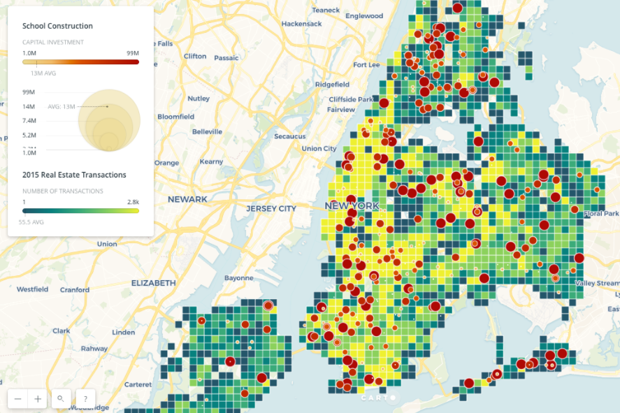

# Review of Homework 8 Plot
### Emily Hansen

 
The plot: 

  
  

Review:

  
## Clarity

There is a lot going on in this plot, with many bright colors and several
different scales of different types of data to consider and process before
any takeaways from the plot may be understood. Due to this, the plot appears
busy and not immediately clear, though its legend is clarifying (sans the 
color of the concentric circles).

## Aesthetic 

The variety of colors with high saturation make the plot challening to read.
The grid size for real estate transactions is also bit too large to serve the
level of geographic precision of the school construction points.

## Honesty

The data are plotted as-is with minimal bias other than restricting
school construction values to a minimum $1M investment. There is no obvious
relationship between school construction and real estate transactions in an area
across the boroughs of NYC, which can be observed in the plot.

## Improvements

Consider using one bright color scheme against a more subdued one when producing
plots of different data sets. If possible, decrease the grid size of the real estate
data or extract the raster values into polygons. A title and caption would be useful.
It would be interesting to see these school construction values
against school zone boundaries! 

# FBB ok

the zoom level of the static image cuts out a portion of NYC! that is a no-no especially in a map that shows a large amount of land which is not relevant to the analysis. this issue propagates to the online viz since the zoo level of the map on carto depends on the window size upon accessing it. 

the color maps are chosen poorly as one ends with yellow, the oter begins with yellow. So the smallest dots are invisible in yellow regions. This significantly affect clarity and possibl honsety

also why is the legend in soft-focus?

9/10
